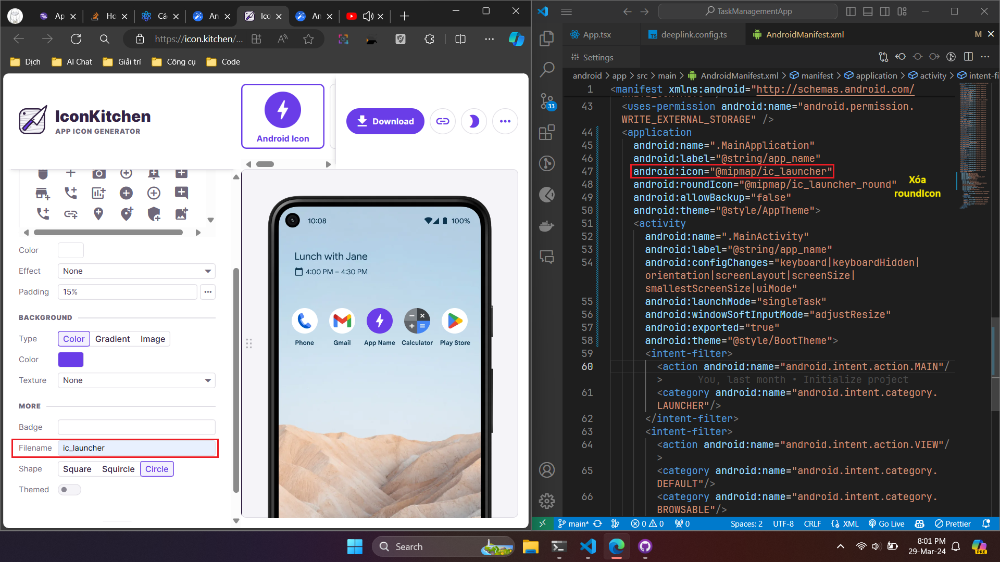
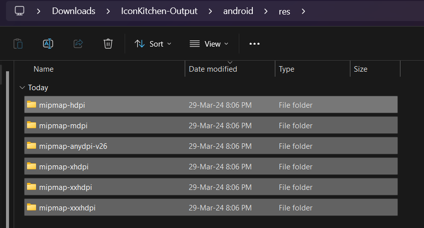

# Cách thay đổi tên app và icon app

## Thay đổi tên app

- Vào file **[Projectname]\android\app\src\main\res\values\strings.xml** và thay đổi tên app ở tag string:

```xml
<resources>
    <string name="app_name">App name</string>
</resources>
```

## Thay đổi logo app

- Đầu tiên, dùng công cụ để tạo logo cho app. Để làm điều này, vào link sau: https://icon.kitchen/
- Sau đó up ảnh icon của app lên, thay đổi màu nền và padding cho phù hợp.

:::caution

- Lưu ý: tên file icon phải khớp với tên được cấu hình trong file **AndroidManifest.xml**
- Sau đó, xóa thuộc tính `android:roundIcon` trong thẻ `application` đi



:::

- Sau khi tải xuống xong và giải nén ra, copy tất cả các file/folder trong thư mục **android/res** và paste vào thư mục **android/app/src/main/res** trong dự án:



- Còn file **play_store_512.png** thì bỏ vào thư mục **android/app/src/main** (cùng cấp với file **AndroidManifest.xml**):

:::note

- Vậy là setup app name với app icon đã xong, để chạy sự thay đổi:

```bash
cd android
./gradlew clean
npx react-native start --reset-cache
```

:::
