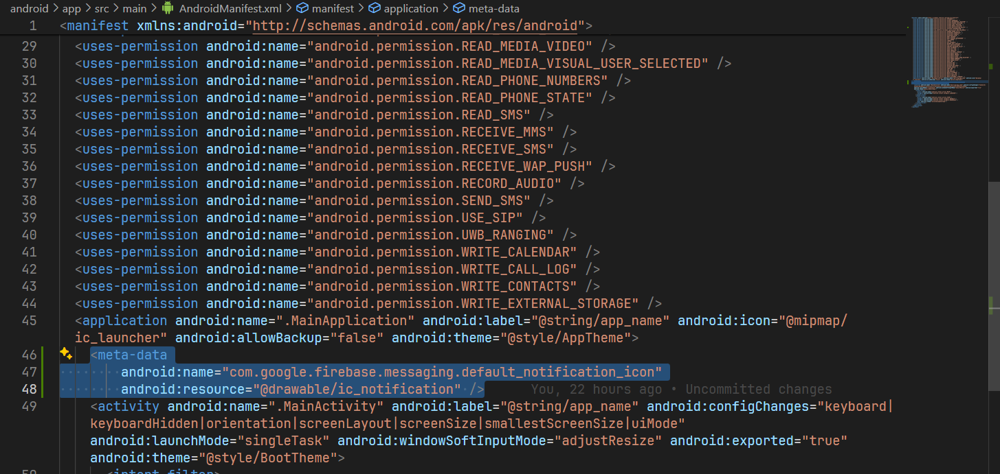

# Cách thay đổi logo của Push Notification

- Vào link sau để tạo logo của push notification: [Tại đây](https://romannurik.github.io/AndroidAssetStudio/icons-notification.html#source.type=clipart&source.clipart=ac_unit&source.space.trim=1&source.space.pad=0&name=ic_stat_ac_unit)
- Đặt tên là: **ic_notification**
- Tải xuống và giải nén ra
- Sau khi giải nén, ta thấy các folder sau:


- Di chuyển các file của các folder như ảnh trên vào trong folder tương ứng trong project tại đường dẫn: **android/app/src/main/res**


- Vào file **android/app/src/main/AndroidManifest.xml** và thêm tag sau:

```xml
<meta-data android:name="com.google.firebase.messaging.default_notification_icon" android:resource="@drawable/ic_notification" />
```



- Và nếu sử thư viện **notifee** thì hãy thêm dòng sau:


