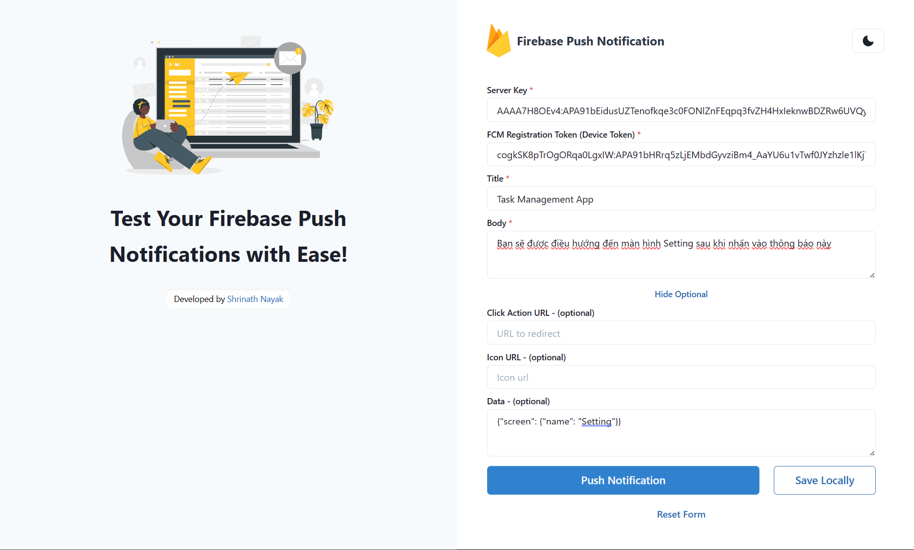
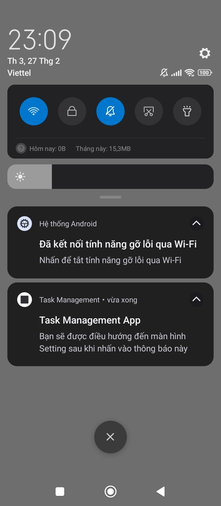

# Cấu hình Deeplink trong React Native

## Deeplink là gì?

- Trong React Native, một deep link (liên kết sâu) là một URL mà người dùng có thể nhấp vào để mở một ứng dụng di động cụ thể hoặc đến một vị trí cụ thể trong ứng dụng. Deep link cho phép người dùng truy cập trực tiếp vào một trang hoặc chức năng trong ứng dụng mà không cần đi qua các bước trung gian.

## Thành phần của một deeplink

- Một deeplink (ví dụ như: **myapp://setting**) gồm 2 thành phần chính:
  - **Scheme** (Giao thức): Trong ví dụ này, "myapp" là scheme (giao thức). Scheme xác định ứng dụng cụ thể mà deep link đang liên kết đến. Trên các nền tảng di động, giao thức thường được định nghĩa trong phạm vi ứng dụng của bạn và phải là duy nhất để không xung đột với các ứng dụng khác.
  - **Path** (Đường dẫn): Trong ví dụ này, "setting" là path (đường dẫn). Path xác định một tài nguyên cụ thể trong ứng dụng mà deep link sẽ mở. Điều này có thể là một màn hình, một chức năng hoặc một trạng thái cụ thể trong ứng dụng của bạn.

## Cài đặt Deeplink

- React Navigation cũng hỗ trợ cho ta việc cấu hình deeplink:
- Ta cài đặt các bộ thư viện đi kèm của React Navigation:

```bash
npm install @react-navigation/native react-native-screens react-native-safe-area-context
```

- Tiếp theo đó, ta sẽ tạo **Scheme URI** thông qua lệnh:

```bash
npx uri-scheme add <SCHEME_URI_NAME> --android
```

- Sau khi tạo xong **Scheme URI**, ta sẽ thấy sự thay đổi trong file **android/app/src/main/AndroidManifest.xml**:

```xml
<activity
    android:name=".MainActivity"
    android:launchMode="singleTask">
    <intent-filter>
        <action android:name="android.intent.action.MAIN" />
        <category android:name="android.intent.category.LAUNCHER" />
    </intent-filter>
    <!-- Scheme URI -->
    <intent-filter>
        <action android:name="android.intent.action.VIEW" />
        <category android:name="android.intent.category.DEFAULT" />
        <category android:name="android.intent.category.BROWSABLE" />
        <data android:scheme="mychat" />
    </intent-filter>
</activity>
```

## Cấu hình linking

- Tạo 1 file **src/configs/deeplink.config.ts**:

```ts
import { APP_BASE_URI } from "@env";
import { LinkingOptions } from "@react-navigation/native";
import { ERootScreenList } from "@src/navigators/screens-name";
import { Linking } from "react-native";

const deepLinksConfig = {
  screens: {
    // Tên "key" phải trùng với name của screen ở trong component <Stack.Screen />
    // "value" chính là path name trong deeplink
    [ERootScreenList.HOME]: "home",
    [ERootScreenList.CONTACT]: "contact",
    [ERootScreenList.SETTING]: "setting",
  },
};

const linking: LinkingOptions<{}> = {
  prefixes: [APP_BASE_URI], // Đây là Scheme URI, đặt trong biến môi trường
  config: deepLinksConfig,
  async getInitialURL() {
    const url = await Linking.getInitialURL();
    if (typeof url === "string") {
      return url;
    }
  },
  subscribe(listener) {
    const linkingSubscription = Linking.addEventListener("url", ({ url }) => {
      listener(url);
    });

    return () => {
      linkingSubscription.remove();
    };
  },
};

export default linking;
```

:::info

- Ta có thể cấu hình nested navigators và kèm thêm params cho một screen.
- Giả sử ta có cấu trúc navigation như sau:

```tsx
function Home() {
  return (
    <Tab.Navigator>
      <Tab.Screen name="Profile" component={Profile} />
      <Tab.Screen name="Feed" component={Feed} />
    </Tab.Navigator>
  );
}

function App() {
  return (
    <Stack.Navigator>
      <Stack.Screen name="Home" component={Home} />
      <Stack.Screen name="Settings" component={Settings} />
    </Stack.Navigator>
  );
}
```

- Khi đó, config sẽ có 2 dạng như sau:

```ts
const config = {
  screens: {
    Home: {
      screens: {
        Profile: "users/:id",
      },
    },
  },
};
```

```ts
const config = {
  screens: {
    Home: {
      screens: {
        Profile: {
          path: "users/:id",
          screens: {
            /* If there are more screen that nested in Profile screen, adđ here */
          },
        },
      },
    },
  },
};
```

- Khi đó ở screen Profile, ta có thể lấy được params **id** như sau:

```tsx
import { useRoute } from '@react-navigation/native';

const ProfileScreen = () => {
  const route = useRoute();
  const { id } = route.params;

  // Sử dụng giá trị 'id' ở đây
  // ...

  return (
    // JSX của màn hình "Profile"
  );
};

export default ChatScreen;
```

:::

- Cuối cùng, ta thêm props **linking** trong component NavigationContainer:

```tsx
import React from "react";
import { SafeAreaProvider } from "react-native-safe-area-context";
import BootSplash from "react-native-bootsplash";

import { NavigationContainer } from "@react-navigation/native";
import GlobalNavigation, {
  navigationRef,
} from "@src/configs/navigation.config";
import { createStackNavigator } from "@react-navigation/stack";
import { ERootScreenList } from "@src/navigators/screens-name";
import HomepageScreen from "@src/screens/home";
import ContactScreen from "@src/screens/contact";
import SettingScreen from "@src/screens/setting";
import styles from "./styles";
import { ChevronLeftIcon } from "@src/assets/icons";
import linking from "@src/configs/deeplink.config";

const Stack = createStackNavigator();

const RootNavigator = () => {
  return (
    <SafeAreaProvider>
      <NavigationContainer ref={navigationRef} linking={linking}>
        <Stack.Navigator
          screenOptions={{
            headerShown: false,
            headerTitleAlign: "center",
            headerTitleStyle: styles.title,
            headerStyle: styles.header,
            headerLeft: () => (
              <ChevronLeftIcon
                style={{ marginLeft: 10 }}
                onPress={() => GlobalNavigation.goBack()}
              />
            ),
          }}
        >
          <Stack.Screen
            name={ERootScreenList.HOME}
            component={HomepageScreen}
            options={{
              headerShown: true,
              headerTitle: "Homepage",
            }}
          />
          <Stack.Screen
            name={ERootScreenList.CONTACT}
            component={ContactScreen}
            options={{
              headerShown: true,
              headerTitle: "Contact",
            }}
          />
          <Stack.Screen
            name={ERootScreenList.SETTING}
            component={SettingScreen}
            options={{
              headerShown: true,
              headerTitle: "Setting",
            }}
          />
        </Stack.Navigator>
      </NavigationContainer>
    </SafeAreaProvider>
  );
};

export default RootNavigator;
```

## Test deeplink

- Vậy là ta đã hoàn tất việc cấu hình deeplink, giờ để test, ta gõ lệnh sau:

```bash
npx uri-scheme open "myapp://setting" --android
```

- Trong câu lệnh trên, nó sẽ tự động mở app và điều hướng thẳng đến màn hình Setting.

## Sử dụng deeplink trong Push Notification

- Notification trong react native có 3 chế độ:
  - **Foreground**: Đây là trạng thái khi ứng dụng đang mở và đang hoạt động trên màn hình chính
  - **Background**: Trong trạng thái này, ứng dụng đang chạy ở nền, tức là không hiển thị trên màn hình chính nhưng vẫn đang hoạt động. Điều này thường xảy ra khi người dùng nhấn nút "Home" trên thiết bị hoặc chuyển sang ứng dụng khác thông qua trình chuyển đổi ứng dụng.
  - **Quit**: Đây là trạng thái khi ứng dụng không hoạt động hoặc đã bị đóng
- Khi app đang ở chế độ **Foreground**, theo mặc định, Firebase sẽ không hiển thị thông báo, do đó, ta phải sử dụng thư viện là **notifee** để xử lý:

```bash
npm install @notifee/react-native
```

- Ta sửa lại file **src/configs/deeplink.config.ts** như sau:

```ts
import { APP_BASE_URI } from "@env";
import { LinkingOptions } from "@react-navigation/native";
import notifee, { AndroidImportance, EventType } from "@notifee/react-native";

import { buildDeepLinkFromNotificationData } from "@src/utils/deeplink.util";
import { Linking } from "react-native";
import messaging from "@react-native-firebase/messaging";
import {
  EAuthScreenList,
  ERootScreenList,
} from "@src/constants/screen-constants";
import { IRemoteMessageData } from "@src/interfaces/push-notification.interface";

const deepLinksConfig = {
  screens: {
    [ERootScreenList.HOME]: "home",
    [ERootScreenList.AUTH_NAVIGATOR]: {
      screens: {
        [EAuthScreenList.LOGIN]: "login",
        [EAuthScreenList.SIGNUP]: "signup",
      },
    },
  },
};

const linking: LinkingOptions<{}> = {
  prefixes: [APP_BASE_URI],
  config: deepLinksConfig,
  async getInitialURL() {
    const url = await Linking.getInitialURL();
    if (typeof url === "string") {
      return url;
    }

    //getInitialNotification: When the application is opened from a quit state.
    const message = await messaging().getInitialNotification();
    if (message?.data) {
      const messageData: IRemoteMessageData = message.data;
      const { navigationKey, navigationParamsInJSON } = messageData;
      const deeplinkURL = buildDeepLinkFromNotificationData(
        navigationKey,
        navigationParamsInJSON
      );
      if (typeof deeplinkURL === "string") {
        return deeplinkURL;
      }
    }
  },
  subscribe(listener) {
    // Listen to incoming links from deep linking
    const linkingSubscription = Linking.addEventListener("url", ({ url }) => {
      listener(url);
    });

    //onNotificationOpenedApp: When the application is running, but in the background.
    const unsubscribe = messaging().onNotificationOpenedApp((remoteMessage) => {
      if (remoteMessage?.data) {
        const messageData: IRemoteMessageData = remoteMessage.data;
        const { navigationKey, navigationParamsInJSON } = messageData;
        const deeplinkURL = buildDeepLinkFromNotificationData(
          navigationKey,
          navigationParamsInJSON
        );
        if (typeof deeplinkURL === "string") {
          listener(deeplinkURL);
        }
      }
    });

    //onForegroundEvent: When the application is in foreground.
    const notifeeForegroundEvent = notifee.onForegroundEvent(
      ({ detail, type }) => {
        if (type === EventType.PRESS) {
          if (detail.notification?.data) {
            const messageData: IRemoteMessageData = detail.notification.data;
            const { navigationKey, navigationParamsInJSON } = messageData;
            const deeplinkURL = buildDeepLinkFromNotificationData(
              navigationKey,
              navigationParamsInJSON
            );
            if (typeof deeplinkURL === "string") {
              listener(deeplinkURL);
            }
          }
        }
      }
    );

    //Display notification when the application is in foreground.
    messaging().onMessage(async (remoteMessage) => {
      const channelId = await notifee.createChannel({
        id: "default",
        name: "Default Channel",
        sound: "notification",
        importance: AndroidImportance.HIGH,
      });
      await notifee.displayNotification({
        title: remoteMessage.notification?.title || "",
        body: remoteMessage.notification?.body || "",
        android: {
          channelId,
          smallIcon: "ic_notification",
        },
        data: remoteMessage.data,
      });
    });

    return () => {
      linkingSubscription.remove();
      unsubscribe();
      notifeeForegroundEvent();
    };
  },
};

export default linking;
```

- Tạo file **src/utils/deeplink.util.ts** để xử lý việc tạo deeplink từ Push Notification:

```js
import { APP_BASE_URI } from "@env";

const constructDeeplinkURI = (pathname: string) => {
  return `${APP_BASE_URI}${pathname}`;
};

export const buildDeepLinkFromNotificationData = (
  navigationKey?: string,
  navigationParamsInJSON?: string
) => {
  if (!navigationKey) {
    return null;
  }
  if (navigationKey === "signup") {
    return constructDeeplinkURI(navigationKey);
  }
  return null;
};
```

- File **src/interfaces/push-notification.interface.ts**:

```ts
export interface IRemoteMessageData {
  navigationKey?: string;
  navigationParamsInJSON?: string;
}
```

- Ở file **index.js**:

```ts
/**
 * @format
 */

import { AppRegistry } from "react-native";
import "react-native-gesture-handler";
import messaging from "@react-native-firebase/messaging";

import App from "./src/App";
import { name as appName } from "./app.json";

messaging().setBackgroundMessageHandler(async (remoteMessage) => {
  console.log("Message handled in the background!");
});

AppRegistry.registerComponent(appName, () => App);
```

- Ví dụ để test gửi thông báo cho người dùng trên app và điều hướng họ đến màn hình Setting như cấu hình bên trên:




