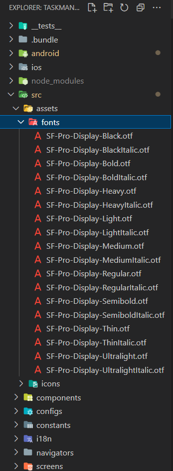

# Sử dụng custom local font trong React Native

- Tạo thư mục tên **assets/fonts** và cho tất cả các file font đuôi .otf hoặc .ttf vào folder đó



- Tạo file **react**-**native**.**config**.**js**:

```js
module.exports = {
  project: {
    ios: {},
    android: {},
  },
  assets: ["./src/assets/fonts"],
};
```

- Tiếp theo, chạy lệnh sau để link font vào project:

```bash
npx react-native-asset
```

- Và giờ ta có thể sử dụng font đó:

```ts
import { StyleSheet } from "react-native";

const styles = StyleSheet.create({
  title: {
    fontFamily: "SF-Pro-Display-Ultralight",
    fontSize: 16,
  },
});

export default styles;
```
