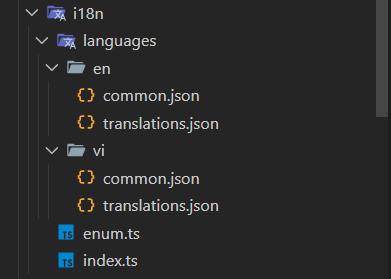
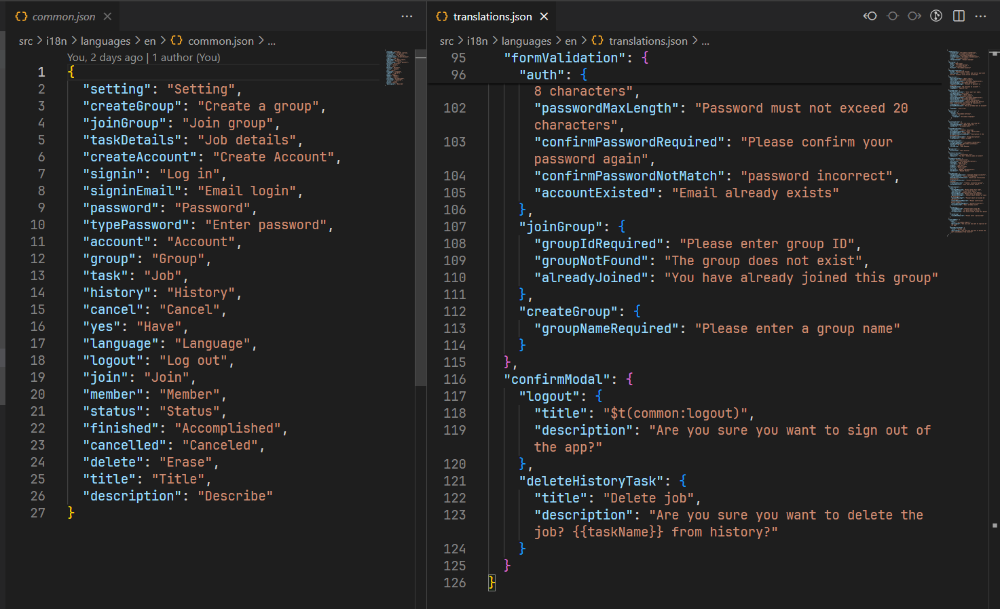
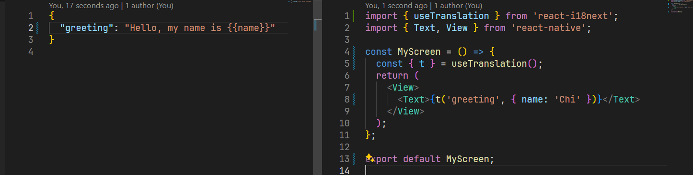
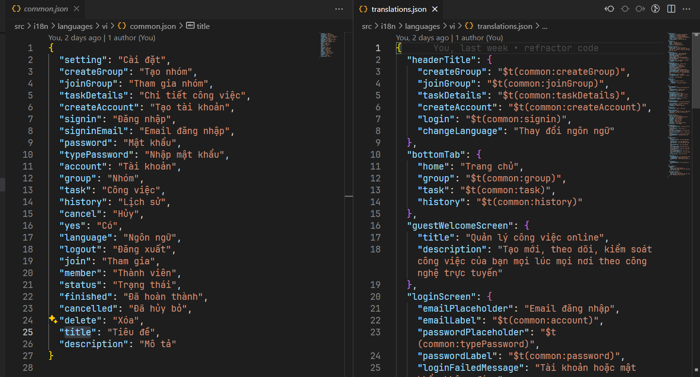

# Thiết lập đa ngôn ngữ trong React Native

## Cài đặt thư viện

```bash
npm install i18next react-i18next
```

## Setup

### Tạo các file và thư mục

- Tạo 1 folder tên **i18n** bên trong thư mục **src**, sau đó tạo các file như ảnh dưới:



- Trong đó:
  - Thư mục **languages** bao gồm 2 thư mục **en** và **vi** là 2 ngôn ngữ mà ta sử dụng trong project. Mỗi thư mục sẽ chứa các file namespace json định nghĩa các cặp key - value để dịch theo ngôn ngữ tương ứng
  - File **enum.ts** định nghĩa tên các namespace và locale.
  - File **index.ts** là file cấu hình cho i18n.

:::info

Trong i18next, "namespace" là một thuật ngữ được sử dụng để chỉ định các phạm vi hoặc không gian của các tài nguyên ngôn ngữ. Cho phép tổ chức và quản lý các bộ ngôn ngữ của ứng dụng một cách có tổ chức.

Với i18next, ta có thể chia các tài nguyên ngôn ngữ của mình thành các namespace khác nhau để phân loại chúng theo các chức năng, thành phần hoặc các phạm vi khác. Như ví dụ ở trên, ta có 2 namespace là **common** (chứa các từ dùng chung) và **translations** (chứa các từ dùng trong các screen trong app). Tùy theo cách tổ chức, ta có thể có nhiều namespace.

:::

- Các file json:



- File **enum.ts**:

```ts
export enum ELanguageNamespaces {
  TRANSLATIONS = "translations",
  COMMON = "common",
}

export enum ELocales {
  VIETNAMESE = "vi",
  ENGLISH = "en",
}
```

:::tip

- Về đặt tên locale, hãy tuân theo tên chuẩn của locale quốc tế.
- Xem tên locale chuẩn theo quốc tế: [Tại đây](https://help.sap.com/docs/SAP_BUSINESSOBJECTS_BUSINESS_INTELLIGENCE_PLATFORM/09382741061c40a989fae01e61d54202/46758c5e6e041014910aba7db0e91070.html)

:::

- Ta định nghĩa một hàm để xác định ngôn ngữ cho app (có thể tách ra một file util riêng):

```ts
import AsyncStorage from "@react-native-async-storage/async-storage";
import { NativeModules, Platform } from "react-native";

import { EStorageKey } from "@src/constants/enum";
import { ELocales } from "@src/i18n/enum";

export const getAppLanguage = async () => {
  const currentAppLanguage = (await AsyncStorage.getItem(
    EStorageKey.I18NLANGUAGE
  )) as ELocales;

  const deviceLanguage = (
    Platform.OS === "ios"
      ? NativeModules.SettingsManager.settings.AppleLocale ||
        NativeModules.SettingsManager.settings.AppleLanguages[0] // iOS 13
      : NativeModules.I18nManager.localeIdentifier
  ).split("_")[0];

  const deviceLanguageExistsInAppConfig = Object.values(ELocales).includes(
    deviceLanguage
  )
    ? deviceLanguage
    : null;

  const defaultLanguage = ELocales.ENGLISH;
  return (
    currentAppLanguage || deviceLanguageExistsInAppConfig || defaultLanguage
  );
};
```

- File **index.ts**:

```ts
/* eslint-disable import/no-named-as-default-member */
import i18next from "i18next";
import { initReactI18next } from "react-i18next";

import { ELocales } from "@src/constants/enum";
import { ELanguageNamespaces } from "@src/i18n/enum";
import enCommon from "@src/i18n/languages/en/common.json";
import enTranslations from "@src/i18n/languages/en/translations.json";
import viCommon from "@src/i18n/languages/vi/common.json";
import viTranslations from "@src/i18n/languages/vi/translations.json";
import { getAppLanguage } from "@src/utils/common.util";

const languageDetector: any = {
  type: "languageDetector",
  async: true,
  detect: async (cb: any) => {
    // Xác định ngôn ngữ để thiết lập cho app
    const language = await getAppLanguage();
    cb(language);
  },
  init: () => {},
  cacheUserLanguage: () => {},
};
const defaultNS = ELanguageNamespaces.TRANSLATIONS; // Namespace mặc định là "translations"

/*
- Định nghĩa resource (là một đối tượng chứa các tài nguyên ngôn ngữ cho ứng dụng)
- Resource được cấu hình dưới đây là một object có hai thuộc tính, ELocales.VIETNAMESE và ELocales.ENGLISH, là các giá trị từ một enum ELocales. Mỗi thuộc tính đại diện cho một ngôn ngữ trong ứng dụng. Mỗi ngôn ngữ lại là một object chứa 2 thuộc tính là 2 namespace, có giá trị là các file json mà ta import ở trên
*/
const resources = {
  [ELocales.VIETNAMESE]: {
    [ELanguageNamespaces.TRANSLATIONS]: viTranslations,
    [ELanguageNamespaces.COMMON]: viCommon,
  },
  [ELocales.ENGLISH]: {
    [ELanguageNamespaces.TRANSLATIONS]: enTranslations,
    [ELanguageNamespaces.COMMON]: enCommon,
  },
};

i18next
  .use(languageDetector)
  .use(initReactI18next)
  .init({
    compatibilityJSON: "v3",
    fallbackLng: ELocales.ENGLISH,
    resources,
    ns: Object.values(ELanguageNamespaces),
    react: {
      useSuspense: false,
    },
    defaultNS,
  });

export default i18next;
```

- Tạo file **i18next.d.ts** ở bên trong thư mục **src** (mục đích file này là để hiển thị gợi ý cho key khi ta dùng hook **useTranslation()**):

```ts
import "i18next";
import viCommon from "@src/i18n/languages/vi/common.json";
import viTranslations from "@src/i18n/languages/vi/translations.json";

declare module "i18next" {
  interface CustomTypeOptions {
    defaultNS: ["translations", "common"];
    resources: {
      common: typeof viCommon;
      translations: typeof viTranslations;
    };
  }
}
```

- Ở file **index.js** (file root của project), hãy import i18n ở file ta vừa config:

```js
/**
 * @format
 */

import messaging from "@react-native-firebase/messaging";
import { AppRegistry } from "react-native";

import "react-native-gesture-handler";
import "./src/i18n"; // Import dòng này
import { name as appName } from "./app.json";
import App from "./src/App";

messaging().setBackgroundMessageHandler(async (remoteMessage) => {
  console.log("Message handled in the background!");
});

AppRegistry.registerComponent(appName, () => App);
```

### Tạo hàm chuyển đổi ngôn ngữ

```tsx
import AsyncStorage from "@react-native-async-storage/async-storage";
import { useEffect, useState } from "react";
import { useTranslation } from "react-i18next";
import { View } from "react-native";

import { UsaFlagIcon, VietnamFlagIcon } from "@src/assets/icons";
import SelectLanguageButton from "@src/components/features/change-language/SelectLanguageButton";
import Loading from "@src/components/UI/Loading";
import { EStorageKey } from "@src/constants/enum";
import { ELocales } from "@src/i18n/enum";
import { tw } from "@src/libs/tailwind";
import { getAppLanguage } from "@src/utils/common.util";

const languages = [
  {
    locale: ELocales.VIETNAMESE,
    flagIcon: <VietnamFlagIcon style={tw("w-[30px] h-[30px]")} />,
    languageName: "Vietnamese",
  },
  {
    locale: ELocales.ENGLISH,
    flagIcon: <UsaFlagIcon style={tw("w-[30px] h-[30px]")} />,
    languageName: "English",
  },
];

const ChangeLanguageScreen = () => {
  const [currentLanguaged, setCurrentLanguage] = useState<ELocales>();
  const { i18n } = useTranslation();

  //Hàm chuyển đổi ngôn ngữ
  const handleChooseLanguage = async (locale: ELocales) => {
    await AsyncStorage.setItem(EStorageKey.I18NLANGUAGE, locale);
    i18n.changeLanguage(locale);
    setCurrentLanguage(locale);
  };

  useEffect(() => {
    (async () => {
      const language = await getAppLanguage();
      setCurrentLanguage(language);
    })();
  }, []);

  return (
    <View style={tw("grow p-5 bg-old_lace")}>
      <View style={tw("flex-row gap-6 flex-wrap justify-between")}>
        {languages.map((language, index) => (
          <SelectLanguageButton
            key={index}
            flagIcon={language.flagIcon}
            languageName={language.languageName}
            locale={language.locale}
            isSelected={currentLanguaged === language.locale}
            onChangeLanguage={handleChooseLanguage}
          />
        ))}
      </View>
      <Loading />
    </View>
  );
};

export default ChangeLanguageScreen;
```

## Sử dụng

- Giờ ta có thể sử dụng hàm **t** được trả về từ hook **useTranslation()** để dịch, ví dụ:

```tsx
import { useTranslation } from "react-i18next";
import { Text, View } from "react-native";

const MyScreen = () => {
  const { t } = useTranslation();
  return (
    <View>
      <Text>{t("common:taskDetails")}</Text>
      <Text>{t("headerTitle.login")}</Text>
    </View>
  );
};

export default MyScreen;
```

:::note

- Vì ở bên trên ta đã cấu hình namespace mặc định là **translations**, cho nên nếu muốn sử dụng namespace khác thì phải thêm tiền tố "[namespace]:" ở đằng trước như ở ví dụ trên là "common:taskDetails"

:::

- Ta có thể truyền giá trị động khi dịch:



- Để sử dụng một namespace khác bên trong file json của một namespace, ta sử dụng **$t(namespace:key)**


