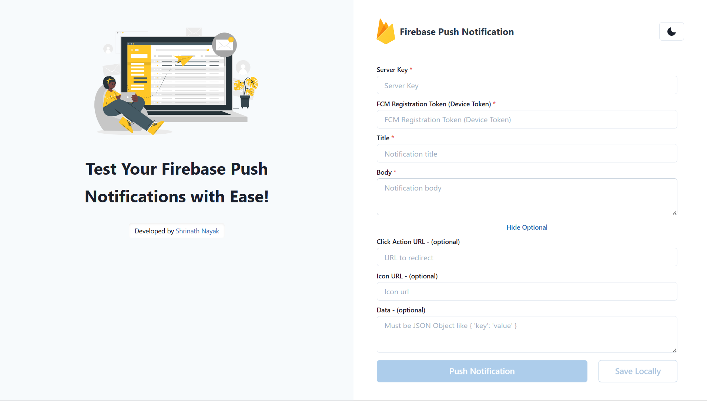

# Sử dụng Push Notification trong React Native

## Setup Firebase

- Vào trang: https://console.firebase.google.com/
- Tạo Project
- Sau khi tạo project xong, ta tạo App Android


- Trong đó:
  - **Android package name**: tên android package, có dạng như _com.taskmanagementapp_ (ta có thể tìm thấy tên này trong file MainApplication.kt)


- Tiếp theo, cấu hình SHA certificate trên firebase bằng cách gõ lệnh sau ở project:
  ```bash
  cd android
  ./gradlew signingReport
  ```


- Tiếp theo, tải file **google-services.json** và đưa file đó vào thư mục **android/app**:


- Vào file **/android/build.gradle** và thêm dòng sau:

```gradle
buildscript {
  dependencies {
    // ... other dependencies
    // NOTE: if you are on react-native 0.71 or below, you must not update
    //       the google-services plugin past version 4.3.15 as it requires gradle >= 7.3.0
    classpath 'com.google.gms:google-services:4.4.1'
    // Add me --- /\
  }
}
```

- Vào file **/android/app/build.gradle** và thêm dòng sau:

```gradle
apply plugin: 'com.android.application'
apply plugin: 'com.google.gms.google-services' // <- Add this line
```

- Cuối cùng, ta enable Cloud Messaging API Server Key trong Firebase:


- Và giờ ta đã có Server Key:


## Cài đặt thư viện

```bash
npm install @react-native-firebase/app @react-native-firebase/messaging
```

## Tạo hàm xử lý Push Notification

- Tạo file **utils/push-notification.util.ts**:

  - Hàm **getFCMToken()**: Mã thông báo FCM là một chuỗi duy nhất được tạo bởi FCM và được gắn với mỗi thiết bị di động đã cài đặt ứng dụng của bạn. Hàm `getFCMToken()` có chức năng lấy mã thông báo FCM từ thiết bị di động hiện tại. Mã thông báo này có thể được sử dụng để xác định một thiết bị cụ thể và gửi thông báo từ máy chủ của bạn đến thiết bị đó thông qua FCM.
  - Hàm **requestUserPermission()** để gửi yêu cầu đến user xem họ có cho phép thông báo của app được bật hay không.

```ts
import AsyncStorage from "@react-native-async-storage/async-storage";
import messaging from "@react-native-firebase/messaging";
import { EStorageKey } from "@src/constants/enum";
import { PermissionsAndroid, Platform } from "react-native";

const getFCMToken = async () => {
  const currentFCMToken = await AsyncStorage.getItem(EStorageKey.FCM_TOKEN);
  console.log("Current FCM Token: ", currentFCMToken);

  if (!currentFCMToken) {
    try {
      const newFCMToken = await messaging().getToken();
      console.log("New FCM Token: ", newFCMToken);
      await AsyncStorage.setItem(EStorageKey.FCM_TOKEN, newFCMToken);
    } catch (error) {
      console.log("Error when getting new FCM Token: ", error);
    }
  }
};

export async function requestUserPermission() {
  if (Platform.OS == "android" && Platform.Version >= 33) {
    const granted = await PermissionsAndroid.request(
      PermissionsAndroid.PERMISSIONS.POST_NOTIFICATIONS
    );
    if (granted === PermissionsAndroid.RESULTS.GRANTED) {
      console.log("Notification permission is granted");
      getFCMToken();
    } else {
      console.log("Notification permission is denied");
    }
  } else {
    const authStatus = await messaging().requestPermission();
    const enabled =
      authStatus === messaging.AuthorizationStatus.AUTHORIZED ||
      authStatus === messaging.AuthorizationStatus.PROVISIONAL;

    if (enabled) {
      console.log("Notification permission is denied");
      getFCMToken();
    }
  }
}
```

- Vào file **TaskManagementApp/android/app/src/main/AndroidManifest.xml** để cấu hình các permission trên Android:

```xml
<manifest xmlns:android="http://schemas.android.com/apk/res/android">
  <uses-permission android:name="android.permission.INTERNET"/>
  <uses-permission android:name="android.permission.ACCEPT_HANDOVER" />
  <uses-permission android:name="android.permission.ACCESS_BACKGROUND_LOCATION" />
  <uses-permission android:name="android.permission.ACCESS_COARSE_LOCATION" />
  <uses-permission android:name="android.permission.ACCESS_FINE_LOCATION" />
  <uses-permission android:name="android.permission.ACCESS_MEDIA_LOCATION" />
  <uses-permission android:name="android.permission.ACTIVITY_RECOGNITION" />
  <uses-permission android:name="com.android.voicemail.permission.ADD_VOICEMAIL" />
  <uses-permission android:name="android.permission.ANSWER_PHONE_CALLS" />
  <uses-permission android:name="android.permission.BLUETOOTH_ADVERTISE" />
  <uses-permission android:name="android.permission.BLUETOOTH_CONNECT" />
  <uses-permission android:name="android.permission.BLUETOOTH_SCAN" />
  <uses-permission android:name="android.permission.BODY_SENSORS" />
  <uses-permission android:name="android.permission.BODY_SENSORS_BACKGROUND" />
  <uses-permission android:name="android.permission.CALL_PHONE" />
  <uses-permission android:name="android.permission.CAMERA" />
  <uses-permission android:name="android.permission.GET_ACCOUNTS" />
  <uses-permission android:name="android.permission.NEARBY_WIFI_DEVICES" />
  <uses-permission android:name="android.permission.POST_NOTIFICATIONS" />
  <uses-permission android:name="android.permission.PROCESS_OUTGOING_CALLS" />
  <uses-permission android:name="android.permission.READ_CALENDAR" />
  <uses-permission android:name="android.permission.READ_CALL_LOG" />
  <uses-permission android:name="android.permission.READ_CONTACTS" />
  <uses-permission android:name="android.permission.READ_EXTERNAL_STORAGE" />
  <uses-permission android:name="android.permission.READ_MEDIA_AUDIO" />
  <uses-permission android:name="android.permission.READ_MEDIA_IMAGES" />
  <uses-permission android:name="android.permission.READ_MEDIA_VIDEO" />
  <uses-permission android:name="android.permission.READ_MEDIA_VISUAL_USER_SELECTED" />
  <uses-permission android:name="android.permission.READ_PHONE_NUMBERS" />
  <uses-permission android:name="android.permission.READ_PHONE_STATE" />
  <uses-permission android:name="android.permission.READ_SMS" />
  <uses-permission android:name="android.permission.RECEIVE_MMS" />
  <uses-permission android:name="android.permission.RECEIVE_SMS" />
  <uses-permission android:name="android.permission.RECEIVE_WAP_PUSH" />
  <uses-permission android:name="android.permission.RECORD_AUDIO" />
  <uses-permission android:name="android.permission.SEND_SMS" />
  <uses-permission android:name="android.permission.USE_SIP" />
  <uses-permission android:name="android.permission.UWB_RANGING" />
  <uses-permission android:name="android.permission.WRITE_CALENDAR" />
  <uses-permission android:name="android.permission.WRITE_CALL_LOG" />
  <uses-permission android:name="android.permission.WRITE_CONTACTS" />
  <uses-permission android:name="android.permission.WRITE_EXTERNAL_STORAGE" />
  <application android:name=".MainApplication" android:label="@string/app_name" android:icon="@mipmap/ic_launcher" android:roundIcon="@mipmap/ic_launcher_round" android:allowBackup="false" android:theme="@style/AppTheme">
    <activity android:name=".MainActivity" android:label="@string/app_name" android:configChanges="keyboard|keyboardHidden|orientation|screenLayout|screenSize|smallestScreenSize|uiMode" android:launchMode="singleTask" android:windowSoftInputMode="adjustResize" android:exported="true">
      <intent-filter>
        <action android:name="android.intent.action.MAIN"/>
        <category android:name="android.intent.category.LAUNCHER"/>
      </intent-filter>
      <intent-filter>
        <action android:name="android.intent.action.VIEW"/>
        <category android:name="android.intent.category.DEFAULT"/>
        <category android:name="android.intent.category.BROWSABLE"/>
        <data android:scheme="mytaskmanagementapp"/>
      </intent-filter>
    </activity>
  </application>
</manifest>
```

- File **App.tsx**:

```tsx
import RootNavigator from "@src/navigators/RootNavigator";
import { requestUserPermission } from "@src/utils/push-notification.util";
import React, { useEffect } from "react";

const App = () => {
  useEffect(() => {
    requestUserPermission();
  }, []);
  return <RootNavigator />;
};

export default App;
```

- Cấu hình vẫn chưa xong, xem tiếp tại: [Sử dụng deeplink với Push Notification](./deeplink#sử-dụng-deeplink-trong-push-notification).

## Test push notification

- Vào trang web: https://testfcm.com/



- Trong đó:
  - **Server Key**: lấy ở trong firebase, xem ảnh trên
  - **FCM Registration Token**: token của máy để gửi notification đến
  - **Title**: tiêu đề của notification
  - **Body**: phần nội dung thông báo
  - **Icon URL**: icon của app trên thanh thông báo
  - **Data**: dữ liệu gửi đến từ thông báo
