# Setup project React Native chạy trên thiết bị Android thật

## Cài đặt môi trường cho React native

### **Bước 1: Cài đặt JDK**

- Mở Window Powershell với quyền Administrator và cài đặt JDK thông qua Chocolatey (Xem cách cài đặt Chocolatey [tại đây](https://chocolatey.org/install#individual-method)):

```bash
choco install -y microsoft-openjdk17
```

- Sau khi cài đặt, để kiểm tra xem cài đặt thành công hay chưa, ta gõ:

```bash
javac --version
```

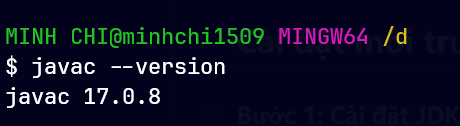

### Bước 2: Cài đặt Android SDK

- Tải file zip SDK Tools Package: [tại đây](https://developer.android.com/studio#command-line-tools-only)
- Sau khi tải về và giải nén ra, ta sẽ thấy bên trong có một thư mục tên **cmdline-tools**
- Sau đó, ta vào đường dẫn: `C:\Users\MINH CHI\AppData\Local` và tạo một thư mục mới tên **android-sdk**
- Copy thư mục **cmdline-tools** vào bên trong thư mục **android-sdk** vừa mới tạo

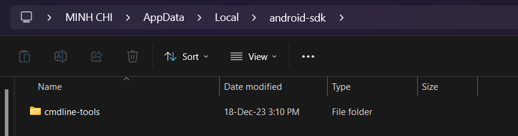

- Bên trong thư mục **cmdline-tools**, tạo một thư mục mới tên **tools** và di chuyển các file và folder còn lại vào thư mục **tools** đó.

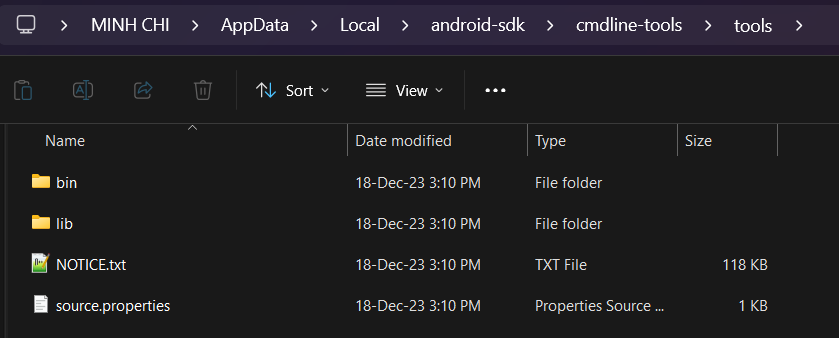

- Mở cmd lên và di chuyển tới đường dẫn: `C:\Users\MINH CHI\AppData\Local\android-sdk\cmdline-tools\tools\bin`
- Gõ lệnh sau:

```bash
sdkmanager "platform-tools" "platforms;android-34"
```

- Sau khi đã cài đặt thành công, ta sẽ thấy có 2 thư mục **platforms** và **platform-tools** như hình bên dưới:

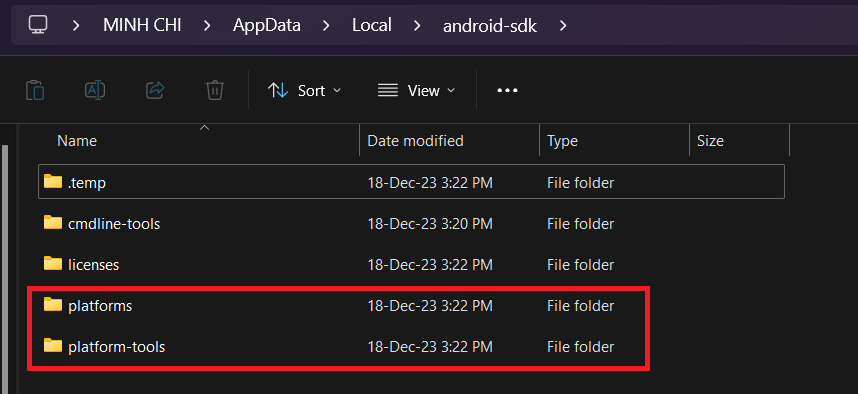

- Tiếp theo, vẫn tại đường dẫn `C:\Users\MINH CHI\AppData\Local\android-sdk\cmdline-tools\tools\bin`, ta gõ lệnh sau và sau đó gõ "y" cho đến hết để accepted tất cả các SDK Package Licenses:

```bash
sdkmanager --licenses
```

### Bước 3: Thêm biến môi trường Android

- Ta tạo biến System tên **ANDROID_HOME** với đường dẫn: `C:\Users\MINH CHI\AppData\Local\android-sdk`

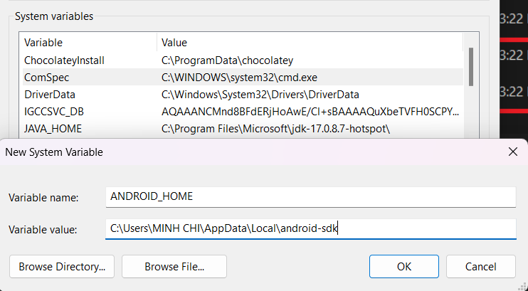

- Sau đó thêm đường dẫn `C:\Users\MINH CHI\AppData\Local\android-sdk\platform-tools` làm biến môi trường bên trong Path:

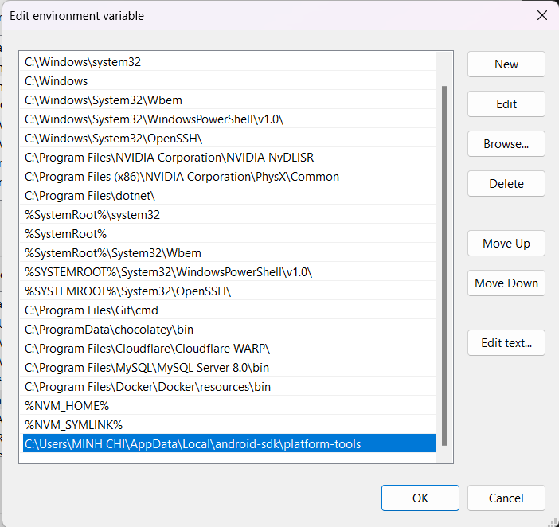

## Thiết lập kết nối giữa laptop và thiết bị Android thật

:::note

- Ta sẽ kết nối thiết bị Android thông qua dây cáp USB và ứng dụng Vysor.
- Xem thêm: Cách kết nối Laptop/PC với thiết bị Android thông qua Wifi (kết nối không cần dùng dây cáp USB) ở bên dưới.

:::

### Trên thiết bị Android

- Trên thiết bị Android, vào CH Play và tải ứng dụng có tên **Vysor - Android control on PC**:


- Trên điện thoại, vào **Cài đặt** -> **Giới thiệu điện thoại** và nhấn liên tục vào phiên bản máy để mở chế độ nhà phát triển:

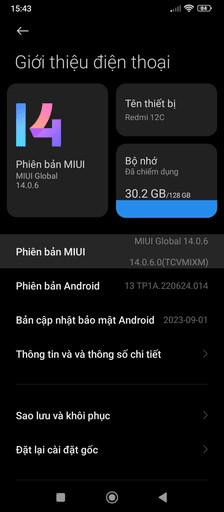

- Tiếp theo, vào **Cài đặt** -> **Cài đặt bổ sung** -> **Tùy chọn nhà phát triển** và bật các tùy chọn ở dưới. Sau khi bật xong các tùy chọn đó, ta phải khởi động lại máy để đảm bảo nó hoạt động.

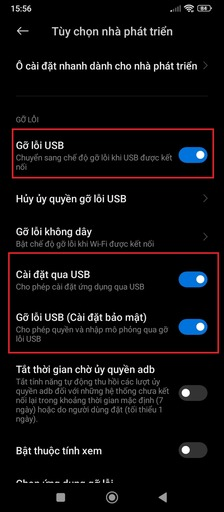

### Trên PC hoặc laptop

- Trên máy tính, tải và cài đặt ứng dụng [Vysor](https://www.vysor.io/):


- Sau khi cài đặt thành công, mở ứng dụng Vysor lên, nếu ta đã cắm dây cáp USB và bật chế độ Debug via USB trên điện thoại, thì sẽ như hình dưới. Bấm vào nút Play (màu đỏ) để mở thiết bị Android trên máy tính:


- Sử dụng lệnh sau để kiểm tra các devices hiện đang kết nối với máy tính:

```bash
adb devices
```

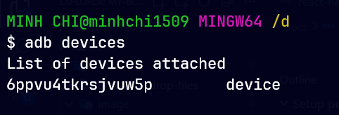

## Khởi tạo project React native

- Sử dụng lệnh sau để khởi tạo project React native:

```bash
npx react-native@latest init MyFirstRNApp
```

- Sau khi khởi tạo xong project, ta sẽ chạy bằng lệnh:

```bash
npm start
```

- Sau đó nhấn phím "a" để nó chạy trên Android. Quá trình chạy lần đầu có thể sẽ hơi lâu (tầm 5 phút).

:::caution

- Lưu ý: trong quá trình chạy, có thể thiết bị Android của bạn sẽ yêu cầu cho phép cài đặt ứng dụng lên máy, hãy chấp nhận để app có thể chạy trên thiết bị của bạn

:::

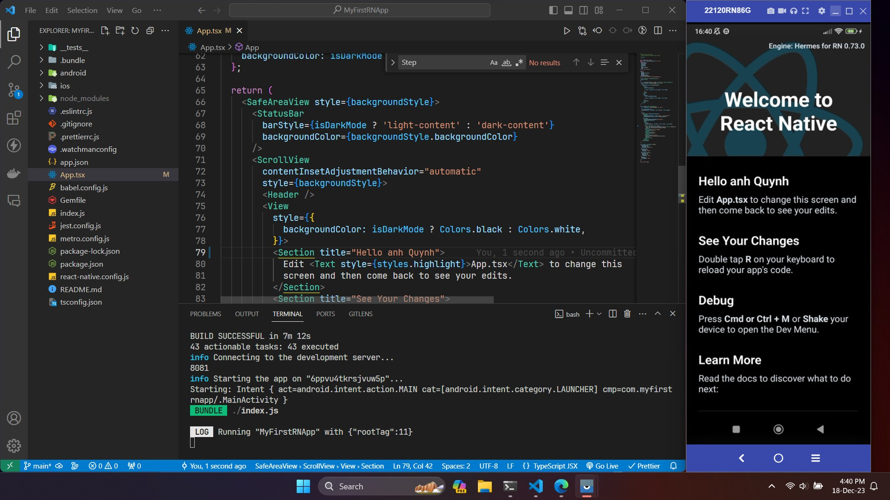


## Kết nối Laptop/PC với thiết bị Android không dây

- Ở trên, ta đã dùng dây cáp USB để kết nối giữa Laptop/PC và thiết bị Android. Ở phần này, ta sẽ tìm hiểu cách kết nối khác thông qua Wifi.

:::caution

- Vì là kết nối thông qua Wifi nên hãy đảm bảo thiết bị Android và Laptop/PC của bạn kết nối tới cùng một wifi

:::

### Trên thiết bị Android

- Vào **Cài đặt** -> **Cài đặt bổ sung** -> **Tùy chọn nhà phát triển** -> **Gỡ lỗi không dây** -> Bật chế độ **Gỡ lỗi không dây**

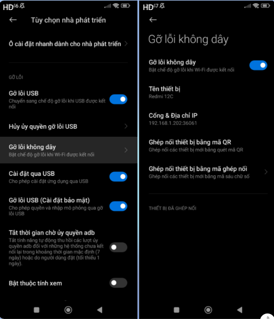

:::caution

- Lưu ý: Hãy đảm bảo rằng bạn vẫn bật 3 tùy chọn: **Gỡ lỗi USB**, **Cài đặt qua USB** và **Gỡ lỗi USB (Cài đặt bảo mật)** như ảnh trên

:::

- Tiếp đó, chọn **Ghép nối thiết bị bằng mã ghép nối**

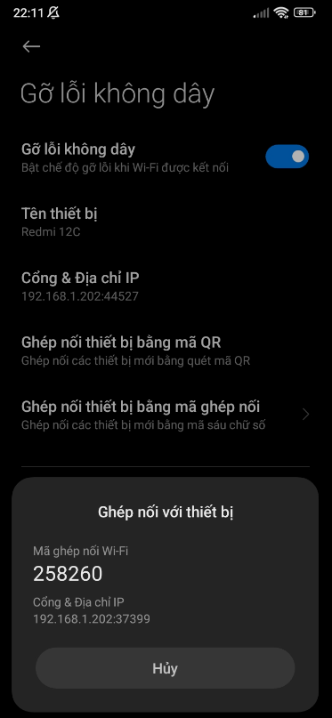

### Trên Laptop/PC

- Lúc này ta sẽ có 2 thông tin quan trọng để kết nối là **Địa chỉ IP** và **Mã ghép nối Wi-Fi**, mở terminal lên và thực hiện ghép nối tới thiết bị Android thông qua lệnh:

```
adb pair <<IP>>
```

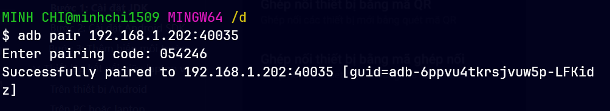

- Tiếp theo ta sẽ connect tới thiết bị Android thông qua IP của nó bằng lệnh:

```bash
adb connect <<IP>>
```

:::caution

- Địa chỉ IP để connect là địa chỉ IP hiển thị như ảnh dưới:

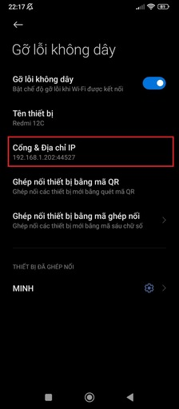

:::

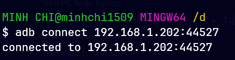


:::success

- Vậy là ta đã kết nối không dây thành công. Giờ ta vẫn có thể thao tác điều khiển điện thoại trên Laptop/PC thông qua ứng dụng Vysor.

:::
