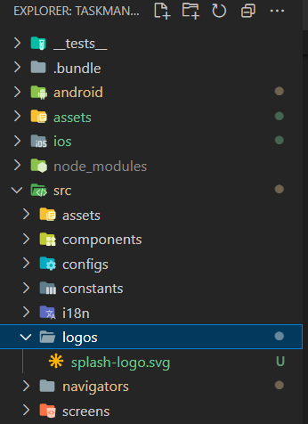

# Tạo Splash screen trong React Native

## Splash screen là gì?

- Trong React Native, splash screen (màn hình khởi động) là một hình ảnh hoặc màn hình hiển thị ngắn gọn xuất hiện khi ứng dụng được khởi chạy lần đầu tiên. Nó thường xuất hiện trong thời gian ngắn trước khi ứng dụng tải và hiển thị nội dung chính.

## Cài đặt Splash screen

- Cài đặt thư viện sau:

```bash
npm install react-native-bootsplash
```

- Tạo file **src/logos/splash-logo.svg** là icon hiển thị trên splash screen:



- Tiếp theo, gõ lệnh sau để tạo ảnh splash screen:

```bash
npx react-native generate-bootsplash src/logos/splash-logo.svg --background=A8E6CF --logo-width=100
```

:::note

- Trong đó, **background** là màu nền của splash screen

:::

- Sau đó, vào file **android/app/src/main/res/values/styles.xml** và thêm:

```xml
<resources xmlns:tools="http://schemas.android.com/tools"> <!-- Add this xmlns:tools -->

    <!-- Base application theme. -->
    <style name="AppTheme" parent="Theme.AppCompat.DayNight.NoActionBar">
        <!-- Customize your theme here. -->
        <item name="android:editTextBackground">@drawable/rn_edit_text_material</item>
    </style>
    <!-- Add this style -->
    <style name="BootTheme" parent="Theme.BootSplash">
        <item name="bootSplashBackground">@color/bootsplash_background</item>
        <item name="bootSplashLogo">@drawable/bootsplash_logo</item>
        <item name="postBootSplashTheme">@style/AppTheme</item>
        <item name="android:statusBarColor" tools:targetApi="m">@color/bootsplash_background</item>
        <item name="android:windowLightStatusBar" tools:targetApi="m">true</item>
  </style>

</resources>
```

- Tiếp theo, vào file **android/app/src/main/AndroidManifest.xml** và thêm:

```xml
<manifest xmlns:android="http://schemas.android.com/apk/res/android">

  <!-- … -->

  <application
    android:name=".MainApplication"
    android:label="@string/app_name"
    android:icon="@mipmap/ic_launcher"
    android:roundIcon="@mipmap/ic_launcher_round"
    android:allowBackup="false"
    android:theme="@style/AppTheme"> <!-- Apply @style/AppTheme on .MainApplication -->
    <activity
      android:name=".MainActivity"
      android:label="@string/app_name"
      android:configChanges="keyboard|keyboardHidden|orientation|screenLayout|screenSize|smallestScreenSize|uiMode"
      android:launchMode="singleTask"
      android:windowSoftInputMode="adjustResize"
      android:exported="true"
      android:theme="@style/BootTheme"> <!-- Apply @style/BootTheme on .MainActivity -->
      <!-- … -->
    </activity>
  </application>
</manifest>
```

- Vào tiếp file **android/app/src/main/java/com/yourprojectname/MainActivity.kt**

```kotlin
// add these required imports:
import android.os.Bundle
import com.zoontek.rnbootsplash.RNBootSplash

class MainActivity : ReactActivity() { {

  // …

  override fun onCreate(savedInstanceState: Bundle?) {
    RNBootSplash.init(this, R.style.BootTheme) // ⬅️ initialize the splash screen
    super.onCreate(savedInstanceState) // super.onCreate(null) with react-native-screens
  }
}
```

- Cuối cùng trong file **RootNavigator.tsx**:

```tsx
import React from "react";
import { SafeAreaProvider } from "react-native-safe-area-context";
import BootSplash from "react-native-bootsplash";

import { NavigationContainer } from "@react-navigation/native";
import GlobalNavigation, {
  navigationRef,
} from "@src/configs/navigation.config";
import { createStackNavigator } from "@react-navigation/stack";
import { ERootScreenList } from "@src/navigators/screens-name";
import HomepageScreen from "@src/screens/home";
import ContactScreen from "@src/screens/contact";
import SettingScreen from "@src/screens/setting";
import styles from "./styles";
import { ChevronLeftIcon } from "@src/assets/icons";
import linking from "@src/configs/deeplink.config";

const Stack = createStackNavigator();

const RootNavigator = () => {
  return (
    <SafeAreaProvider>
      <NavigationContainer
        ref={navigationRef}
        linking={linking}
        onReady={() => {
          BootSplash.hide({ fade: true }); // Add this options in NavigationContainer component
        }}
      >
        <Stack.Navigator
          screenOptions={{
            headerShown: false,
            headerTitleAlign: "center",
            headerTitleStyle: styles.title,
            headerStyle: styles.header,
            headerLeft: () => (
              <ChevronLeftIcon
                style={{ marginLeft: 10 }}
                onPress={() => GlobalNavigation.goBack()}
              />
            ),
          }}
        >
          <Stack.Screen
            name={ERootScreenList.HOME}
            component={HomepageScreen}
            options={{
              headerShown: true,
              headerTitle: "Homepage",
            }}
          />
          <Stack.Screen
            name={ERootScreenList.CONTACT}
            component={ContactScreen}
            options={{
              headerShown: true,
              headerTitle: "Contact",
            }}
          />
          <Stack.Screen
            name={ERootScreenList.SETTING}
            component={SettingScreen}
            options={{
              headerShown: true,
              headerTitle: "Setting",
            }}
          />
        </Stack.Navigator>
      </NavigationContainer>
    </SafeAreaProvider>
  );
};

export default RootNavigator;
```
